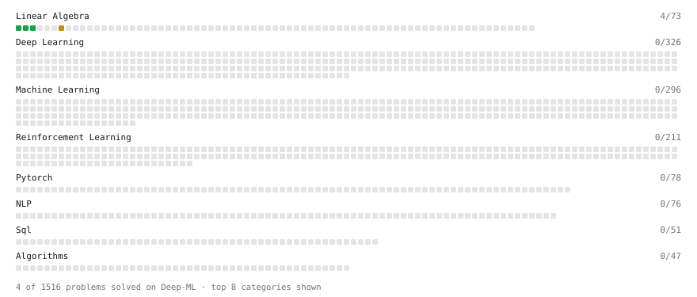

# Deep-ML

My machine learning practice from [Deep-ML](https://www.deep-ml.com). Every solution here was written by hand.

**7** solved · 7 problems · 0 labs · 0 math

[**Browse the interactive portfolio**](https://roboak.github.io/deep-ml/) to replay this filling in over time.

## Problems

| | Difficulty | Solved | |
| --- | --- | --- | --- |
| [Matrix-Vector Dot Product](https://www.deep-ml.com/problems/1) | easy | 2026-10-03 | [solution](problems/0001-matrix-vector-dot-product) |
| [Reshape Matrix](https://www.deep-ml.com/problems/3) | easy | 2026-10-03 | [solution](problems/0003-reshape-matrix) |
| [Sigmoid Activation Function Understanding](https://www.deep-ml.com/problems/22) | easy | 2026-10-08 | [solution](problems/0022-sigmoid-activation-function-understanding) |
| [Softmax Activation Function Implementation ](https://www.deep-ml.com/problems/23) | easy | 2026-10-05 | [solution](problems/0023-softmax-activation-function-implementation) |
| [Transpose of a Matrix](https://www.deep-ml.com/problems/2) | easy | 2026-10-03 | [solution](problems/0002-transpose-of-a-matrix) |
| [Implement Self-Attention Mechanism](https://www.deep-ml.com/problems/53) | medium | 2026-10-05 | [solution](problems/0053-implement-self-attention-mechanism) |
| [Matrix Transformation ](https://www.deep-ml.com/problems/7) | medium | 2026-10-03 | [solution](problems/0007-matrix-transformation) |

---

_This file is regenerated by Deep-ML on every push._
